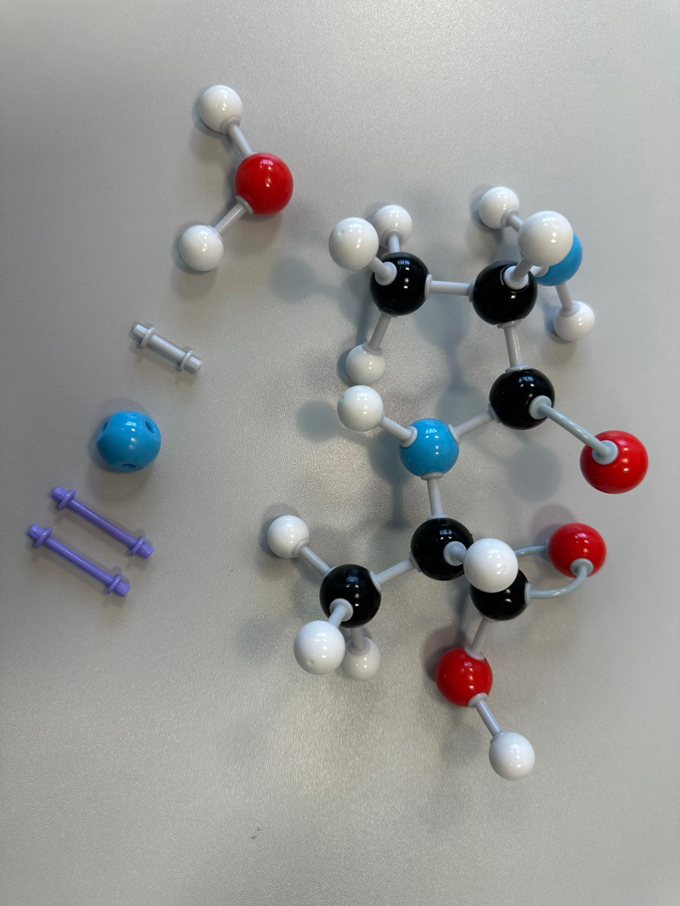
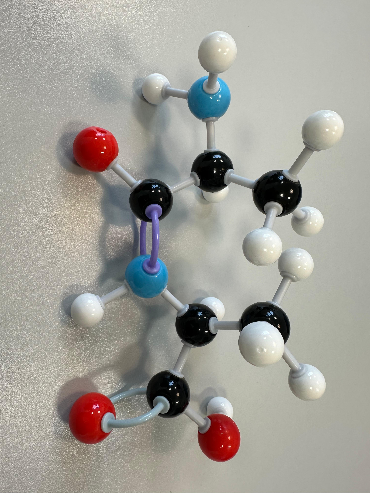
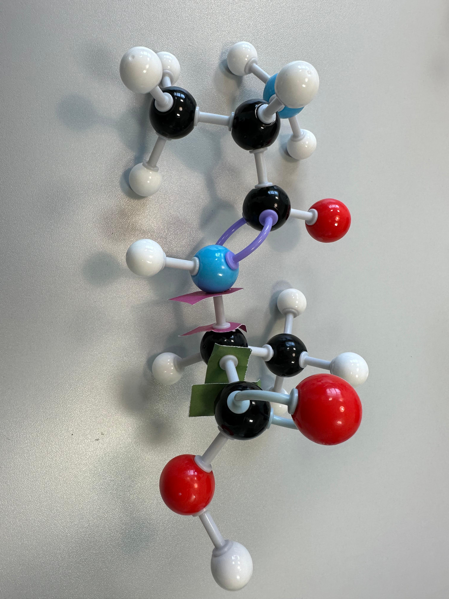
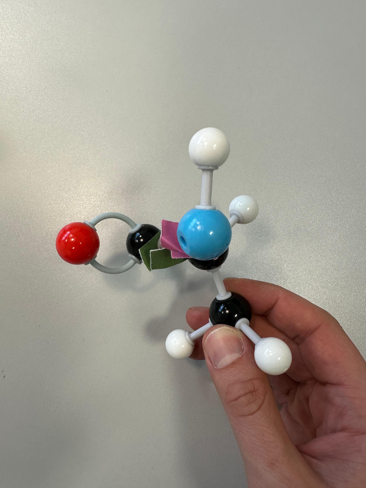
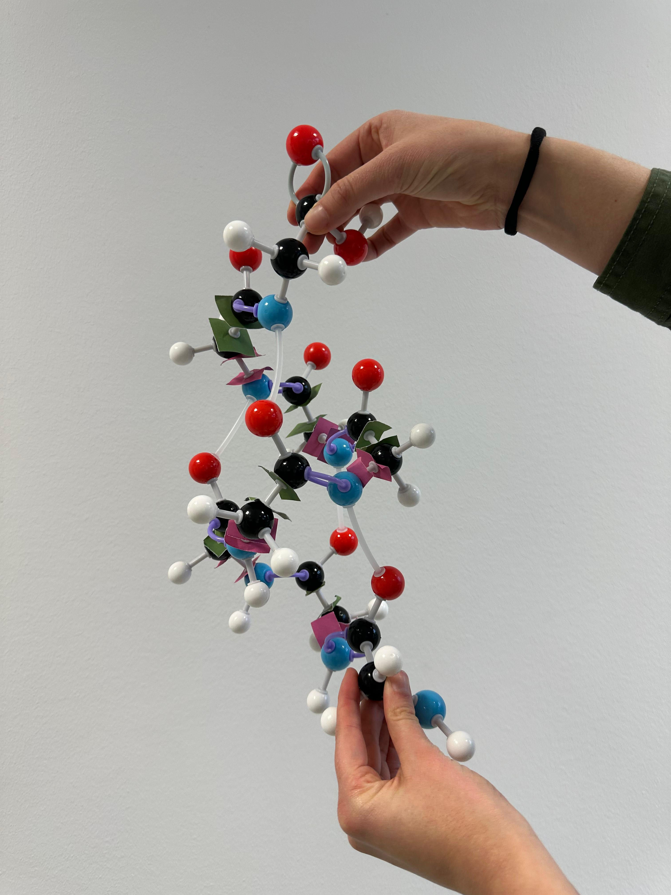

= Protein Structure and Thermodynamics Workshop
:icons: font
:source-highlighter: rouge
:toc: left

== Amino acids building blocks
In our atomic models, black beads represent carbon atoms, blue nitrogen, red oxigen, yellow sulfur and small white beads represent hydrogen atoms.
We start by building the most simple amino acid, glycine (G).

.Building a glycine.

All amino acids have an amino group and a carboxyl group.
Between them, there could be a large chain of carbon atoms, but most amino acids in our proteins world have only one, the alpha carbon, and hence are named alpha amino acids.

.From left to right, an alpha amino acid, a beta amino acid, and a gamma amino acid.

These two groups and the alpha carbon form the main chain of an amino acid, but there can also be a lateral chain attached to the alpha carbon.
There are 20 amino acids directly enconded by DNA codons, which differ by the lateral chain. Let us try to build an amino acid with our models.
Since amino acids are chiral at the alpha carbon, be careful to build a left-hand, L enantiomer, like all our proteinogenic amino acids (with rare exceptions), not a right-hand, D enantiomer.

.A left-handed (L) alanine and a right-handed (D) alanine.

The peptide bond is formed between the carboxyl group of one amino acid with the amino group of the next amino acid.
In this reaction, the amino group loses one hydrogen atom and the carboxyl loses a hydroxyl group, which join to form a water molecule.
Always in this direction, the direction of the chain, from the amino terminus to the carboxyl terminus.
Because the amino group or the carboxyl group or both after the peptide bond became amide and carbonyl groups, respectively, what is left are not strictly amino acids, and are rather called residues.

.Making a peptide bond.

Around the peptide bond, electrons resonate from the oxygen to the nitrogen, conferring the peptide bond an extra rigidity, almost as if the peptide bond were a double bond.
We make the peptide bond in our models a double bond, with long purple sticks. For this we need to replace the nitrogen blue bead by one with four holes.

.Making a rigid (purple) peptide bond.

The extra rigid peptide bond brings the alpha carbons of each amino acid into the same plane together with the nitrogen and its hydrogen and the carbonyl group (the carbon and the oxygen), summing up to 6 atoms in the same plane.

.The planar peptide bond.

Around the rigid peptide bound, the peptide group can only adopt a cis or a trans conformation.
The cis conformation is rare due to the energetic costs of the proximity of the lateral chains. Trans amino acids are much more common, and alternate the lateral chains in space.

.A cis and a trans amino acids.

After so many constrains, the flexibility of the peptide or the protein chain relies on two torsion angles around each peptide plane, Phi and Psi.
We identify Phi and Psi with little colored paper squares at the bonds that define the axis of rotation of both angles.
Phi is represented by pink flags and Psi by green flags. These paper cuts also help to fix the chosen angle for Phi and Psi in our atomic models.
Phi rotates around the bond between N and Calpha. Psi rotates around the bond Calpha and carbonyl C.

.Two torsion angles: Phi, around the bond between N and Calpha, in green; and Psi, around the bond between Calpha and carbonyl C, in pink.

Phi and Psi vary from -180 to +180 degrees around a conventional position.

.Convention of Phi defined as dihedral angle at 0, +90 an -90 degrees.

.Convention of Psi defined as dihedral angle at 0, +90 an -90 degrees.

The conformation of the main chain of a protein can be entirely defined by Phi and Psi torsion angles.
Ramachandran proposed to analyse these angles in what we know today as the Ramachandran plot. Where each residue is identified by a dot with certain Phi and Psi.
image:: (example of a Ramachandran plot)

Ramachandran noticed that not all values of Phi and Psi are possible for all amino acids, due to steric impediments or clashes.
See what happens with Phi = Psi = 0 degrees.

.Phi = Psi = 0 degrees.
image:building_blocks_images/

Helices appear for any sequential repeats of Phi and Psi. Residues in an alpha helix appear in the region around Phi = -60 and Psi = -60.
In this helix hydrogen bonds are formed between the carbonyl group of residue i and the amide group of residue i+4.
This helix points all the lateral chains outwards (as do all helices), but it also fills all the space at the axis (not too tight, not too loose), and creates a dipole in the direction of the chain.

.ALpha helix viewed from the side and from the top.

Residues in a beta sheet appear in the upper left region of the Ramachandran plot.
Try to make two extended strands with Phi = -180 and Psi = 180.

.Extended strand.
image:building_blocks_images/

Adjacent beta strands make hydrogen bonds between the carbonyl group of a residue in one strand and the amide group in the other strand.
In the sheet the lateral chains of sequential residues alternate between pointing up and pointing down, which slightly twist the hydrogen bonds.
To avoid this twist, beta sheets are rather twisted themselves, with Phi = -135 and Psi = 135.

.Twisted parallel and antiparallel beta strands.

The twist in the beta sheet leads to motifs shaped like a saddle or like a barrel (in the case of shear between strands).

Due to the polymeric nature of proteins, a globular conformation is energetically preferred over the extended conformation.
When the proteins fold into a globular shape, they form a hydrophobic core.
Alpha helices and beta sheets are the perfect way to handle the amide and carbonyl groups' polarity inside the apolar core.
They are major secondary structures, abundant in proteins, and building blocks for more complex and varied structural motifs.

== Prediction with AlphaFold3

Predicting with link:https://www.nature.com/articles/s41586-024-07487-w[AlphaFold3] could not be easier.
In link:https://alphafoldserver.com/[AlphaFold3 server] paste the sequence of the protein to be modelled, and information on other entities to be predicted together.
If you prefer to use IPK local installation of AlphaFold2 in the future, please check our link:https://github.com/amandascamara/Protein-Structure-Workshop[other tutorial] on the topic.
In this tutorial we will predict the structure of protein X, which has the sequence below.
[source,]
----
>ProteinX
xxxxxxxxxxxx
----
We will also predict the structure bound to its ligand. Unfortunately, the real ligand, molecule Y, is not among the possible ligands recognisable by AlphaFold3.
So we will take a similar one, Ligand J.

Not long after, AlphaFold3 outputs 3 main informations: the structure (colored by predicted link:https://www.ncbi.nlm.nih.gov/pmc/articles/PMC3799472/[Local Distance Difference Test] - plDDT),
the Predicted Aligned Error (PAE) and predicted link:https://en.wikipedia.org/wiki/Template_modeling_score[Template Modelling] (pTM) scores for the entire prediction (pTM) and for the residues in the interface between subnunits (ipTM).
The pLDDT and pTM values derive from usual comparison measurements between two protein structures (lDDT and TM). But the 'predicted' term indicates the models are compared with the ground truth.
PAE was introduced with AlphaFold2 and gives the error distance of residue x if the predicted and 'true' structures were aligned at residue y (an asymmetric matrix).
It measures the relative position between two residues.
Moreover, it reflects the relative position of domains.
In some cases, the structure of different domains is well predicted, but not their relative position,
and this appears in the PAE, as explained in the section 'How to interpret the Predicted Aligned Error' present in every entry of link:https://alphafold.ebi.ac.uk/[AlphaFold Protein Structure Database], like in this link:https://alphafold.ebi.ac.uk/entry/Q9Y223#help[example].

It also allows the download of the following files:
[source,sh]
----
*_full_data_?.json <1>
*_job_Request.json <2>
*_model_?.cif <3>
*_summary_confidences_?.json <4>
terms_of_use.md <5>
----
All files can be read with text editors.

<1> For each output model, a file that has lists that correspond to the chain ID and plDDT of each atom, pae, chain ID and residue number for each residue.

<2> The input information given by the user and the seed used, so that the same prediction can be done again.

<3> These are the most expected files - five structure files, globally ranked by a mixture of pTM, ipTM, amount of disorder and clashes (model_0 has the best score).

<4> For each output model, a file with lists of pTM, ipTM and PAE for the chains, plus the fraction of disorder (here defined as above a threshold of relative solvent accessible surface area), the existence of clashes and the number of recycles used to determine the protein structure as in AlphaFOld2.

<5> Terms of use from Google, which you agree upon running the prediction with a google account.

More about the output can be found on the link:https://github.com/google-deepmind/alphafold3/[github of AlphaFold3] and on the paper's link:https://static-content.springer.com/esm/art%3A10.1038%2Fs41586-024-07487-w/MediaObjects/41586_2024_7487_MOESM1_ESM.pdf[supplementary material] .
Compared to the output of AlphaFold2, this output is summarised.
Main missing information is the verbose on the prediction steps and the multiple sequence alignments, which are substantially reduced and de-emphasized in the new pipeline, which rather compares sequence pairs (still, information on which sequences are paired would be appreciated).
It also explicitly outputs a value for disorder based on RASA (Relative solvent Accessible Surface Area) metrics, not relying on plDDT anymore.
It also ceased to output timings on the steps of the prediction, as AlphaFold2 did, but it is much faster.

The .cif structure files (an improve version of the old .pdb format) can be read with a text editors. .cif files usually have a reader with information on the source of the file,
 with metrics from the experiment used to solve this structure (in this case some detail s about AlphaFold3),
 some metrics on the molecules, and, most important, the atomic coordinates together with plDDT values for each atom (AlphaFold2 output only the confidence per residue).

== Analysing the structures with PyMOL

Structure files can also be opened with programs for visualising molecules.
We are going to use PyMOL, a molecular visualisation program written in Python, hence the 'Py' suffix.
It was released for the first time in 2000 as an open source and free software by DeLano Scientific LLC with a vision of open science.
Since 2010 it is commercialized by Schrödinger, Inc. and some of the source code are no longer released.
Pymol can be downloaded in link:https://www.pymol.org/[Schrödinger’s webpage], including its source code.
It also has a link:https://pymolwiki.org/index.php/Main_Page[wiki page] very useful, full of examples and tutorials.
Alternative programs are Chimera, RasMOL, VMD (specially useful for molecular dynamics) and Coot (specially useful for building and validating models with crystallographic data).

PyMOL works both with graphical interface and command line.

image::Pictures/Picture1.png[]

Those many options allow different ways of working with molecules to do similar things.
Throughout this tutorial we will show both ways, mouse actions and command lines, whenever possible.
Mouse actions will start with # and will be coloured in [olive]#olive#.
Command lines will follow > and will be highlighted as Python codes.

We can open a structure file in different ways:
[source,python]
----
# File -> Open... -> ... select downloaded AlphaFold3 model file
>
load /path2file/model_0.cif
----

After uploaded, the structure will appear as a new object at the sidebar with the name of the file without the .cif extension.
image::Pictures/Picture2.png[width=200]

We can colour it to show AlphaFold's confidence for each residue.
[Source,python]
----
# Color of model_0 -> spectrum -> b-factors <1>
>
set_color n0, [0.051, 0.341, 0.827] <2>
set_color n1, [0.416, 0.796, 0.945]
set_color n2, [0.996, 0.851, 0.212]
set_color n3, [0.992, 0.490, 0.302]
color n0, b < 100
color n1, b < 90
color n2, b < 70
color n3, b < 50
----
<1> Colouring by mouse command only has limited options for colouring
<2> But by command line we can set the same colours as in AlphaFold's standard representation.

Another way to upload a structure is by online fetching.
This feature automatically searches for a .cif file in the online link:https://www.rcsb.org/[Protein Data Bank] with the given PDB code.
Let us try to fecth protein X solved by cristallography, PDB code 1xyz
[source,python]
----
# File -> Get PDB... -> 1xyz
>
fetch 1xyz
----

Now you should have 2 objects displayed at your sidebar.
A click at the name of an object will disable or enable it.

=== Structural superposition

To compare their structural variability more easily, we should superpose them.
[source,python]
----
# Action of 4pcf_A -> align -> to molecule -> 4pc8
# Action of 4pc8 -> center
>
align 4pcf_A, 4pc8
center 4pc8
----

The align command first performs a sequence alignment and then minimises the Root Mean Square Deviation of the aligned residues.
Sometimes the proteins, or conformations of the same protein, are very different and it is more useful to just superpose a selected region of them.

[source,python]
----
# Mouse selection mode Residues -> select residues 14 to 57 of model_0
# Action of (sele) -> rename selection -> Renaming sele to model_0-domainA
# select residues 14 to 57 of 1xyz
# Action of (sele) -> to selection -> model_0-domainA
>
select model_0-domainA, model_0 and resi 14-57
select 1xyz-domainA, 1xyz and resi 14-57
align 1xyz-domainA, model_0-domainA
center 1xyz-domainA
----

Just a parentheses, there are many ways of selecting a region with PyMOL, using its own link:https://pymolwiki.org/index.php/Selection_Algebra[selection language]

Now se if you can superpose your predicted structure with the other predictions from other colleagues. Are AlphaFold predictions always the same?
